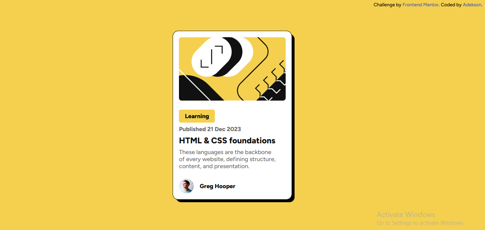

# Frontend Mentor - Blog preview card solution

This is a solution to the [Blog preview card challenge on Frontend Mentor](https://www.frontendmentor.io/challenges/blog-preview-card-ckPaj01IcS). Frontend Mentor challenges help you improve your coding skills by building realistic projects.

## Table of contents

- [Overview](#overview)
  - [The challenge](#the-challenge)
  - [Screenshot](#screenshot)
  - [Links](#links)
- [My process](#my-process)
  - [Built with](#built-with)
  - [What I learned](#what-i-learned)
  - [Continued development](#continued-development)
  - [Useful resources](#useful-resources)
- [Author](#author)
- [Acknowledgments](#acknowledgments)

## Overview

### The challenge

Users should be able to:

- See hover and focus states for all interactive elements on the page

### Screenshot



### Links

- Solution: [Github](https://github.com/adektivity/Blog_Preview)
- Live Site : [Blog_Preview](https://adektivity.github.io/Blog_Preview/)

## My process

### Built with

- Semantic HTML5 markup
- CSS custom properties
- Flexbox
- CSS Grid
- Mobile-first workflow

### What I learned

Learned how to add shadow effects to card elements in css. Also, I further improved on my knowledge of Grid and flexbox and their use in centering elements on a webpage.

```css
.card {
  background: var(--secondary-color);
  padding: 1rem 1rem;
  place-self: center;
  margin: 0 auto;
  max-width: 320px;
  outline: 1px solid var(--heading-color);
  border-radius: 0.875rem;
  box-shadow: 0.5rem 0.5rem;
}
```

### Continued development

I'm going to keep improving on my knowledge of Grid in CSS. I'll also like to improve on structuring my CSS code syntax well so as to improve readability and continued development.

### Useful resources

- [Github Article](https://github.com/openshift-evangelists/kbe/issues/55) - This helped me resolved an issue I had while pushing updates to my repository.
- [CSS Box Shadow](https://www.w3schools.com/css/css3_shadows_box.asp) - This web documentation helped me with adding a shadow effect to my design. I had no idea that this even existed.

## Author

- Website - [Adekson](https://github.com/adektivity/)
- Frontend Mentor - [@adektivity](https://www.frontendmentor.io/profile/adektivity)
- Twitter - [@AdeksonWeb](https://x.com/AdeksonDev)

## Acknowledgments

To everyone out there making and contributing to free learning resources: 21 gbosas for you all!👊🏼👊🏼
